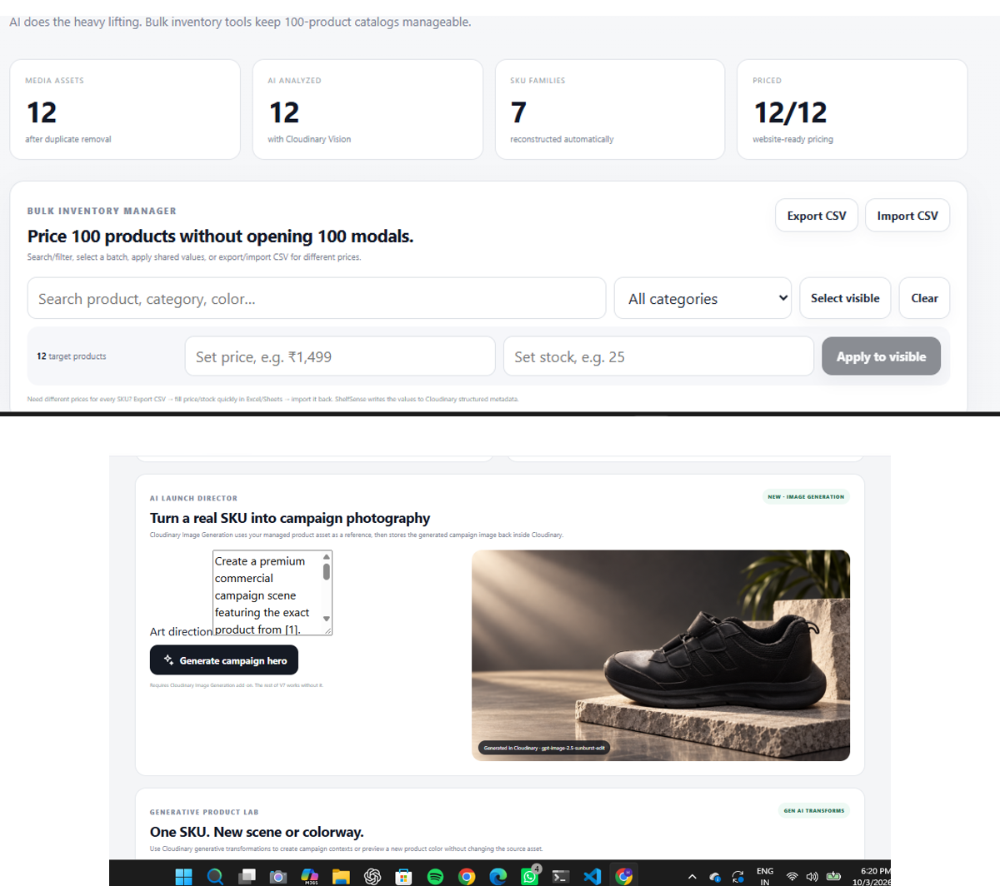
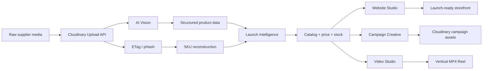

<div align="center">

# 🚀 LaunchForge AI

### **One supplier folder in. A launch-ready business out.**

Cloudinary-powered commerce launch studio that turns messy product media into a structured catalog, launch intelligence, storefronts, campaign creatives, and cinematic product videos.

<p>
  <a href="https://launchforge-ai-65yf.vercel.app/"><b>🌐 Live Demo</b></a>
  ·
  <a href="https://drive.google.com/file/d/1cQ1_hoDlyTPFOwrwFBh0la8cIz1dAD_N/view?usp=sharing"><b>🎬 Demo Video</b></a>
  ·
  <a href="https://github.com/cherukuriharshadatta-cpu/launchforge-ai"><b>💻 Source</b></a>
</p>


**Pixels to Products — Cloudinary AI Hackathon 2026**  
**Track PS-03 · Your Media-Savvy Startup**

</div>

---

## The idea

Small sellers rarely begin with a clean ecommerce database.

They begin with:

- WhatsApp product images
- supplier folders
- duplicate files
- inconsistent photography
- multiple views of the same item
- no SKU structure
- no metadata
- no storefront
- no campaign assets

**LaunchForge starts before the catalog exists.**

> **Messy supplier media → AI understanding → structured catalog → launch intelligence → storefront → campaign → cinematic video**

**Give us the mess. We give you the business.**

---

## Product overview

<p align="center">
  
</p>

LaunchForge uses Cloudinary as the **media operating layer**, not just file hosting.

A seller can upload raw product media and move through one connected workflow:

1. **Understand** — AI Vision extracts product identity and attributes.
2. **Reconstruct** — duplicate and visual-similarity evidence helps rebuild product/SKU structure.
3. **Prepare** — Media Doctor checks launch readiness and image quality.
4. **Merchandise** — price, stock, metadata and bulk catalog tools make the inventory usable.
5. **Launch** — generate storefront directions and campaign imagery.
6. **Promote** — turn product stills into vertical Cloudinary-powered motion videos.

---

## Why LaunchForge is different

Most ecommerce tools assume the seller already has:

- a clean catalog,
- product names,
- SKUs,
- polished media,
- and structured data.

LaunchForge attacks the messy step **before all of that**.

| Typical workflow | LaunchForge |
|---|---|
| Manually clean supplier images | Start with the raw folder |
| Manually identify products | AI-assisted product understanding |
| Manually group product views | SKU reconstruction signals |
| Edit products one-by-one | Bulk price/stock + CSV workflows |
| Build storefront separately | Storefront generated from the catalog |
| Create marketing separately | Campaign media uses the same managed assets |
| Edit social video separately | Cloudinary storyboard Reel engine |

The same managed media stays connected through the whole launch workflow.

---

## Cloudinary at the core

| Cloudinary capability | How LaunchForge uses it |
|---|---|
| **Upload API** | Raw supplier/product media ingestion |
| **AI Vision** | Product understanding, attributes and view metadata |
| **ETag** | Exact duplicate evidence |
| **pHash** | Perceptual-similarity evidence for SKU grouping |
| **Quality analysis** | Media Doctor checks |
| **Structured/context metadata** | Product and commerce information attached to assets |
| **Image transformations** | Catalog, campaign and storefront derivatives |
| **`f_auto` / `q_auto`** | Optimized media delivery |
| **Image generation / generative transforms** | Campaign scenes and product creative workflows where account access allows |
| **Zoompan** | Static product image → motion shot |
| **Video splice + transitions** | Multi-shot Reel composition |
| **Video text layers** | Product name, headline and CTA overlays |

Cloudinary is therefore the **media intelligence + transformation + delivery layer** that connects the product experience end to end.

---

## Architecture



---

## Main product areas

### 1. Launch
Bulk upload the supplier/product folder and begin a launch project.

### 2. Catalog
Review AI-understood products and manage:

- name
- category
- color
- style
- material
- tags
- description
- price
- stock

For larger catalogs, LaunchForge includes search, batch actions and CSV import/export.

### 3. Launch Intelligence
The core differentiator.

Launch Intelligence brings together:

- product/SKU evidence
- duplicate handling
- trusted multi-angle views
- Media Doctor
- product metadata
- campaign generation
- launch-readiness signals

### 4. Website Studio
Generate storefront directions from the same catalog instead of forcing every business into one generic layout.

### 5. Video Studio
Create vertical product motion using a Cloudinary-native storyboard pipeline:

**product still → multiple zoom/pan shots → transitions → text overlays → MP4**

Motion styles include cinematic, social and premium/luxury directions.

---

## Judge walkthrough

For the fastest evaluation:

1. Open the **[Live Demo](https://launchforge-ai-65yf.vercel.app/)**.
2. Explore the catalog and launch-intelligence workflow.
3. Open **Website Studio** to preview storefront directions.
4. Open **Video Studio** and generate a product Reel.
5. Watch the **[submitted demo video](https://drive.google.com/file/d/1cQ1_hoDlyTPFOwrwFBh0la8cIz1dAD_N/view?usp=sharing)** for the complete fresh-upload AI Vision flow.
6. For fresh AI Vision testing with your own quota, use the BYOK setup below.

---

## Hosted demo & AI Vision quota note

The public deployment is designed to remain explorable even if the project owner's **Cloudinary AI Vision free-tier allowance** is exhausted.

When the hosted account returns a quota/rate-limit response, LaunchForge can use a **pre-analyzed Cloudinary-backed demo catalog** so judges can still evaluate the downstream product workflow.

The submitted demo video shows the complete fresh-upload AI Vision flow functioning before the hosted free-tier allowance was exhausted.

This limitation is account quota related, not a dependency on localhost.

---

## Bring Your Own Cloudinary Keys

For a full fresh-analysis test, run LaunchForge locally using your own Cloudinary account.

### 1. Clone

```bash
git clone https://github.com/cherukuriharshadatta-cpu/launchforge-ai.git
cd launchforge-ai
npm install
```

### 2. Create `.env.local`

```env
CLOUDINARY_CLOUD_NAME=your_cloud_name
CLOUDINARY_API_KEY=your_api_key
CLOUDINARY_API_SECRET=your_api_secret
```

Enable the **Cloudinary AI Vision** add-on if you want fresh product analysis.

### 3. Run

```bash
npm run dev
```

Open:

```text
http://localhost:3000
```

> **Security:** LaunchForge never asks judges to paste their Cloudinary API secret into the public Vercel deployment. BYOK secrets stay in the judge's own local/server environment.

---

## Tech stack

- **Next.js 16**
- **React 19**
- **TypeScript**
- **Cloudinary Node SDK**
- **Cloudinary AI Vision**
- **Cloudinary image + video transformations**
- **Vercel**
- optional OAuth integrations for social publishing

---

## Repository structure

```text
launchforge-ai/
├── app/                  # Next.js UI + API routes
├── lib/                  # Cloudinary, AI and commerce logic
├── public/               # Demo media and static assets
├── docs/                 # Product/technical notes
├── .env.example
├── .gitignore
├── LICENSE
├── README.md
├── package.json
├── next.config.mjs
└── tsconfig.json
```

---

## Security

The following must never be committed:

- `CLOUDINARY_API_SECRET`
- OAuth client secrets
- private access tokens
- `.env.local`

The repository's `.gitignore` excludes local environment files.

---

## Links

- 🌐 **Live app:** https://launchforge-ai-65yf.vercel.app/
- 🎬 **Demo video:** https://drive.google.com/file/d/1cQ1_hoDlyTPFOwrwFBh0la8cIz1dAD_N/view?usp=sharing
- 💻 **GitHub:** https://github.com/cherukuriharshadatta-cpu/launchforge-ai
- 💼 **LinkedIn launch post:** https://www.linkedin.com/posts/harsha-cherukuri-506593320_github-cherukuriharshadatta-cpulaunchforge-ai-activity-7512211904119853056-rxoy
- 𝕏 **X launch post:** https://x.com/HarshaCherpjwx/status/2106447579328430471

---

## License

MIT License.
