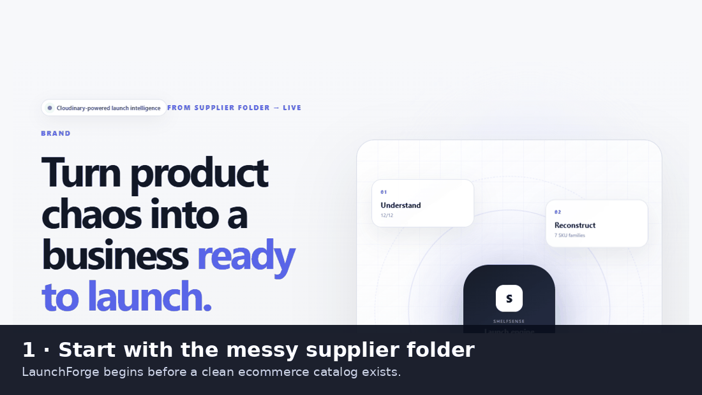
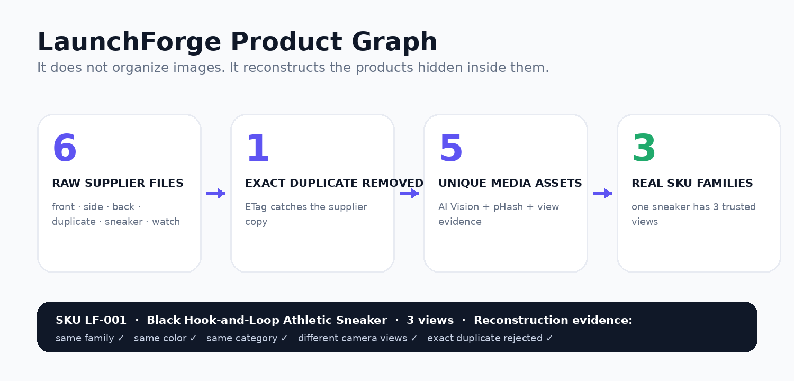
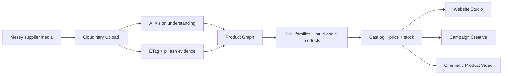
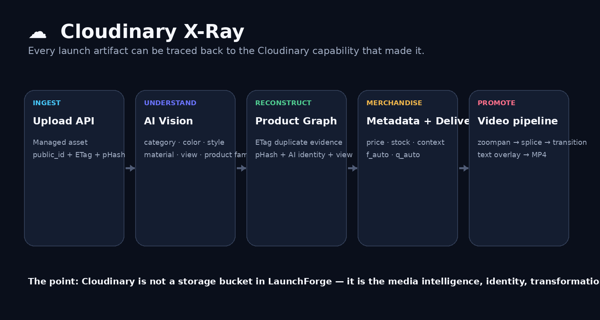
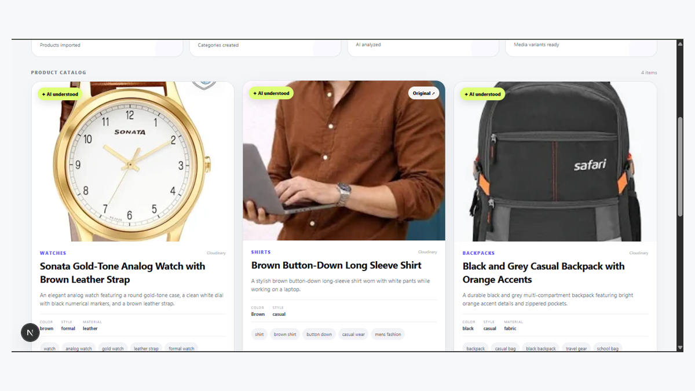
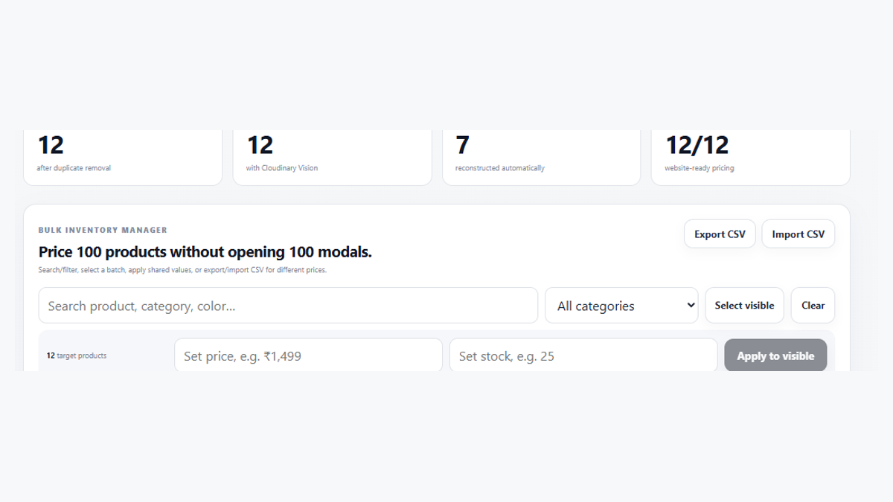
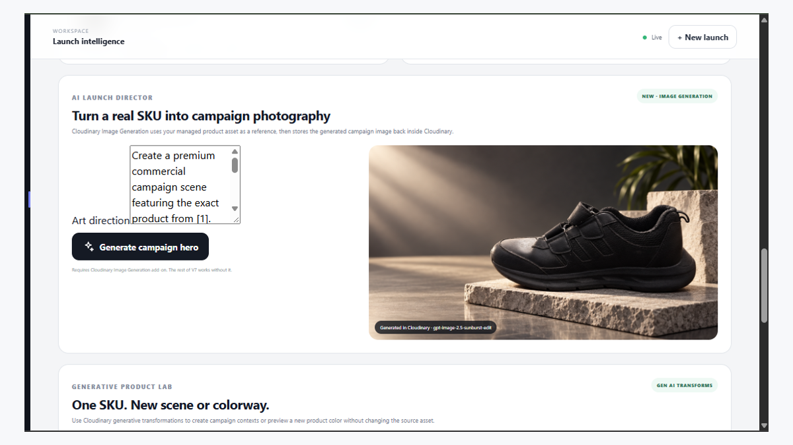

<div align="center">

# 🚀 LaunchForge AI

### **Give us the messy supplier folder. We give you the business.**

**LaunchForge reconstructs the commerce structure hidden inside unstructured product media — then carries those products all the way to catalog, storefront, campaign and video.**

<p>
  <a href="https://launchforge-ai-65yf.vercel.app/"><b>🌐 Live Demo</b></a>
  &nbsp;·&nbsp;
  <a href="https://drive.google.com/file/d/1cQ1_hoDlyTPFOwrwFBh0la8cIz1dAD_N/view?usp=sharing"><b>🎬 3-minute Demo</b></a>
  &nbsp;·&nbsp;
  <a href="#-how-judges-should-try-it"><b>⚡ Judge Path</b></a>
  &nbsp;·&nbsp;
  <a href="#-bring-your-own-cloudinary-keys"><b>🔑 BYOK</b></a>
</p>


**Pixels to Products — Cloudinary AI Hackathon 2026**  
**Track PS-03 · Your Media-Savvy Startup**

</div>

<p align="center">
  
</p>

---

## ⚡ Try the idea in 60 seconds

1. Open the **[live deployment](https://launchforge-ai-65yf.vercel.app/)**.
2. Press **Judge Replay** to load a deterministic, quota-safe launch.
3. Open **Intelligence → Product Graph**.
4. Inspect the reconstructed sneaker: **three camera views become one product family** while an exact duplicate is rejected.
5. Press **☁ Cloudinary X-Ray** to see which Cloudinary capability powers each step.
6. Continue to **Catalog → Website → Video** to see the reconstructed products become a business.

> The full fresh-upload AI Vision run is shown in the **[submitted demo video](https://drive.google.com/file/d/1cQ1_hoDlyTPFOwrwFBh0la8cIz1dAD_N/view?usp=sharing)**.

---

# The problem is not “make my product photo prettier”

Small sellers, boutiques and wholesalers often receive inventory as a chaotic media folder:

```text
IMG_2048.jpg
WhatsApp Image 17.jpg
shoe-front.jpg
shoe-side.jpg
shoe-back.jpg
shoe-front-copy.jpg
watch-final2.jpg
...
```

Before they can build a store, they still have to answer:

- Which files are duplicates?
- Which photos are the **same physical product** from another angle?
- How many actual products are in this folder?
- What is each product?
- Which media is good enough to launch?
- How do I turn all of this into sellable inventory?

Most commerce tools start **after a catalog already exists**.

**LaunchForge starts before the catalog exists.**

---

# 🧠 The LaunchForge Product Graph

<p align="center">
  
</p>

The judge demo deliberately includes:

- **6 raw supplier files**
- front, side and back views of the same black sneaker
- an intentional exact duplicate
- a different sneaker
- a watch

LaunchForge reconstructs that media into:

- **1 exact duplicate rejected**
- **5 unique managed media assets**
- **3 real product/SKU families**
- **1 product with 3 trusted camera views**

This is the core LaunchForge idea:

> ### **LaunchForge does not organize images. It reconstructs products.**

For every reconstructed family, the UI can expose the evidence used to support the grouping — product identity, category/color agreement, view information, exact-duplicate evidence and perceptual-similarity signals.

That reconstructed product becomes the unit that flows through the rest of the business.

---

# From Product Graph → launch-ready commerce



The same managed product media remains connected throughout the workflow.

| Stage | LaunchForge does | Cloudinary role |
|---|---|---|
| **Ingest** | Bulk supplier media upload | Upload API + managed assets |
| **Understand** | Product name, category, material, color, style, tags, view | AI Vision |
| **Reconstruct** | Exact duplicates + likely product families + multi-angle views | ETag + pHash + AI evidence |
| **Prepare** | Media health / launch readiness | Quality analysis + resolution signals |
| **Merchandise** | Price, stock, descriptions, bulk CSV workflows | Context / structured metadata |
| **Deliver** | Optimized catalog/store media | `f_auto`, `q_auto`, transformations |
| **Create** | Campaign imagery from the real SKU | Image generation / generative transforms where enabled |
| **Promote** | Multi-shot vertical product Reel | zoompan + splice + transitions + text overlays |

---

# ☁ Cloudinary X-Ray

<p align="center">
  
</p>

A Cloudinary-sponsored hackathon should make the Cloudinary work **visible**.

LaunchForge therefore exposes a **Cloudinary X-Ray** from SKU reconstruction so a judge can inspect the media pipeline instead of taking our README's word for it.

For a reconstructed product, X-Ray connects:

```text
SOURCE
Cloudinary managed asset / public_id

        ↓

UNDERSTANDING
AI Vision
category · color · style · material · camera view · product family

        ↓

IDENTITY / PRODUCT GRAPH
ETag exact-duplicate evidence
pHash perceptual-similarity evidence
multi-angle grouping

        ↓

COMMERCE
price · stock · product metadata
optimized media delivery

        ↓

PROMOTION
zoompan → splice → transition → text overlay → MP4
```

Cloudinary is therefore **not passive image hosting** in LaunchForge. It is the media intelligence, identity, transformation and delivery layer that the product depends on.

---

# What LaunchForge actually launches

## 1 · Reconstructed catalog

<p align="center">
  
</p>

The catalog is generated from the media rather than manually created first.

LaunchForge can carry forward:

- product name
- category
- color
- style
- material
- description
- tags
- camera view
- product family
- price
- stock

## 2 · Inventory at scale

<p align="center">
  
</p>

Search, batch price/stock operations and CSV import/export are designed for the point where a supplier folder contains **dozens or hundreds of products**, not one hero image.

## 3 · Campaign media from the same SKU

<p align="center">
  
</p>

The managed product asset becomes campaign media without breaking the connection back to inventory.

## 4 · Cloudinary Storyboard Reel

A single managed product still becomes a deterministic vertical product video:

```text
Shot 1: cinematic push
        ↓
transition
        ↓
Shot 2: hero movement
        ↓
transition
        ↓
Shot 3: reveal
        ↓
product headline + product name + CTA
        ↓
720×1280 MP4
```

The engine uses Cloudinary-native motion/editing primitives rather than a local video editor:

- `e_zoompan`
- clip upload/management
- `fl_splice`
- transition effects
- text overlays
- MP4 delivery

If advanced composition is unavailable, LaunchForge falls back to a verified motion clip instead of breaking the judge flow.

---

# Why this is different from an AI product-photo tool

A product-photo generator usually starts with:

> **one known product → new visual assets**

LaunchForge starts one step earlier:

> **unknown messy media → figure out what the products actually are → then launch them**

That is why the Product Graph matters.

```text
MEDIA TOOL
photo → prettier photo

LAUNCHFORGE
supplier folder
   → understand media
   → reject duplicates
   → reconstruct real products
   → recover product views
   → attach commerce data
   → launch catalog
   → storefront
   → campaign
   → video
```

The launch assets are important, but **inventory reconstruction is the differentiator**.

---

# 🧪 Deterministic Judge Replay

Hackathon judging should not depend on whether a free AI quota happens to be available at that exact minute.

LaunchForge includes a deterministic Judge Replay built from a previously verified product set.

It demonstrates:

- one multi-angle sneaker family
- an exact duplicate that must be removed
- two other distinct products
- real Cloudinary-backed assets
- downstream Catalog / Intelligence / Website / Video flows

If the hosted Cloudinary AI Vision allowance is exhausted, judges can still explore the entire business workflow without pretending a fresh analysis occurred.

The submitted demo video preserves the original fresh-AI run.

---

# 📊 Engineering proof

The repository includes judge-readiness checks covering:

```text
✓ Product Graph is exposed in the live UX
✓ Cloudinary X-Ray is available from SKU reconstruction
✓ Judge Replay provides a deterministic path
✓ demo launch contains three verified views of one sneaker SKU
✓ demo launch exercises exact duplicate removal
✓ Reel engine builds three Cloudinary motion shots
✓ Reel engine includes transitions and text overlays
✓ Reel engine has a non-breaking fallback
✓ Cloudinary secrets are protected by .gitignore
✓ BYOK instructions remain documented
```

Run:

```bash
npm run verify
```

Current expected result:

```text
tests 10
pass 10
fail 0
```

Production readiness:

```bash
npm run build
```

---

# 🔑 Bring Your Own Cloudinary Keys

Judges who want to run **fresh AI Vision analysis** can test LaunchForge with their own Cloudinary account without giving credentials to our hosted application.

```bash
git clone https://github.com/cherukuriharshadatta-cpu/launchforge-ai.git
cd launchforge-ai
npm install
```

Create `.env.local`:

```env
CLOUDINARY_CLOUD_NAME=your_cloud_name
CLOUDINARY_API_KEY=your_api_key
CLOUDINARY_API_SECRET=your_api_secret
```

Enable Cloudinary AI Vision for that account, then:

```bash
npm run dev
```

Open:

```text
http://localhost:3000
```

**Security:** LaunchForge never asks a judge to paste `CLOUDINARY_API_SECRET` into the public Vercel deployment.

---

# 🏗 Tech stack

- Next.js 16
- React 19
- TypeScript
- Cloudinary Node SDK
- Cloudinary AI Vision
- Cloudinary image transformations
- Cloudinary video transformations
- Vercel
- optional OAuth integrations for social publishing

---

# ⚡ How judges should try it

### Fastest path

**[Open LaunchForge](https://launchforge-ai-65yf.vercel.app/)**

Then:

```text
Judge Replay
   ↓
Product Graph
   ↓
open the multi-angle black sneaker
   ↓
Cloudinary X-Ray
   ↓
Catalog
   ↓
Website Studio
   ↓
Video Studio
```

### Full original walkthrough

**[Watch the submitted demo](https://drive.google.com/file/d/1cQ1_hoDlyTPFOwrwFBh0la8cIz1dAD_N/view?usp=sharing)**

---

# Links

- 🌐 **Live deployment:** https://launchforge-ai-65yf.vercel.app/
- 🎬 **Demo video:** https://drive.google.com/file/d/1cQ1_hoDlyTPFOwrwFBh0la8cIz1dAD_N/view?usp=sharing
- 💻 **Repository:** https://github.com/cherukuriharshadatta-cpu/launchforge-ai
- 💼 **LinkedIn:** https://www.linkedin.com/posts/harsha-cherukuri-506593320_github-cherukuriharshadatta-cpulaunchforge-ai-activity-7512211904119853056-rxoy
- 𝕏 **X:** https://x.com/HarshaCherpjwx/status/2106447579328430471

---

# License

MIT
